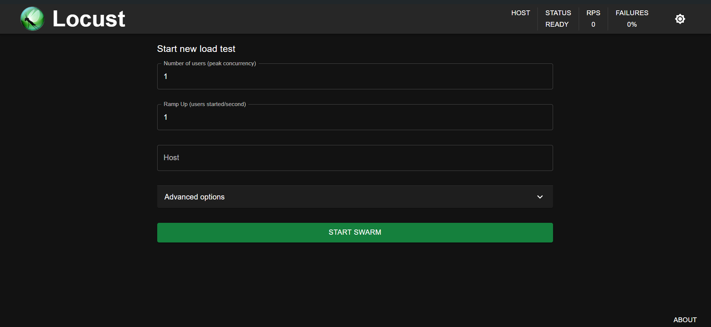
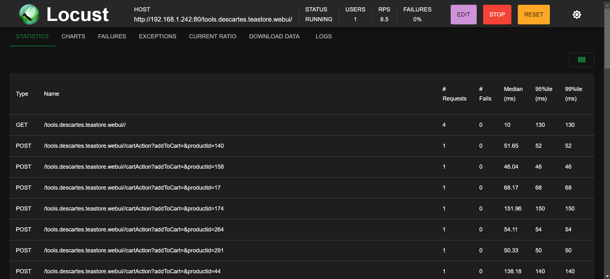

# Locust
An open source load testing tool.

## Instalation 

1. Install python on the Ubuntu machine
```sh
sudo apt update && sudo apt install python3 python3-pip
```

2. Install locust
```sh
pip3 install locust
```


## Your first test


A Locust test is essentially just a Python program making requests to the system you want to test. This makes it very flexible and particularly good at implementing complex user flows. 

In the folder `docs/other-configurations/testing-tools/locust/`, you will find a general test `locustfile.py` that allows you to test most of the Teastore application endpoints: visit home, login, browse, buy products, visit profile and logout.

Additionally, there is a test that only tests the authentication endpoints `locustfile-auth.py`: login and logout. With this file, only the authentication service will be stress tested.

In order to run the file do:

```sh
locust -f <your-locustfile-name>.py
```

you can add additional parameters to the command above, such as:
- **--run-time**: Stop after the specified amount of time, e.g. 
                (300s, 20m, 3h, 1h30m, etc.). Defaults to run forever. 


## Locust’s web interface
1. Open http://localhost:8089



2. Provide the hostname of the server and try it out
