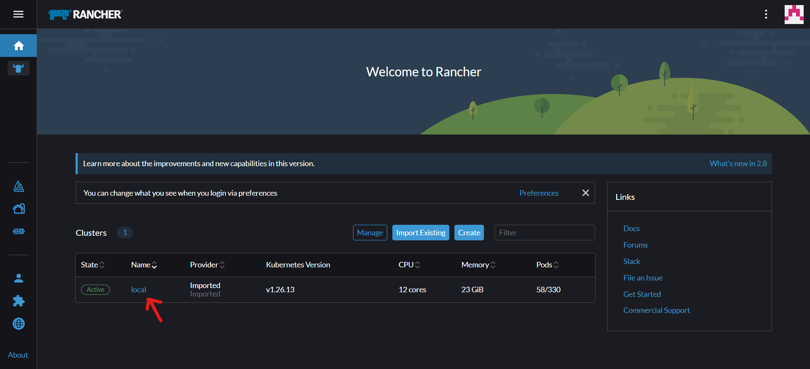
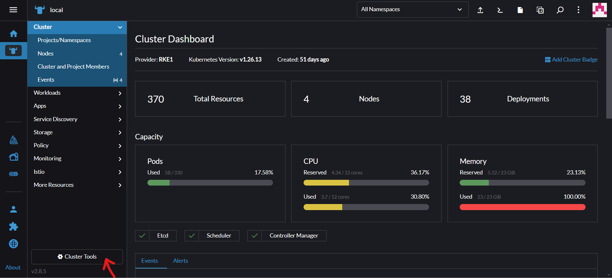
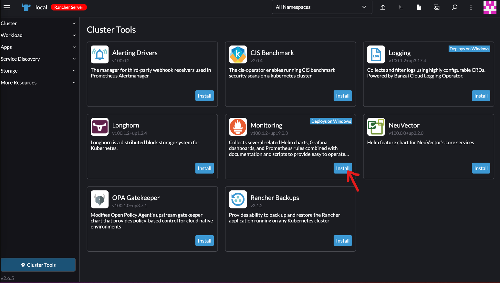
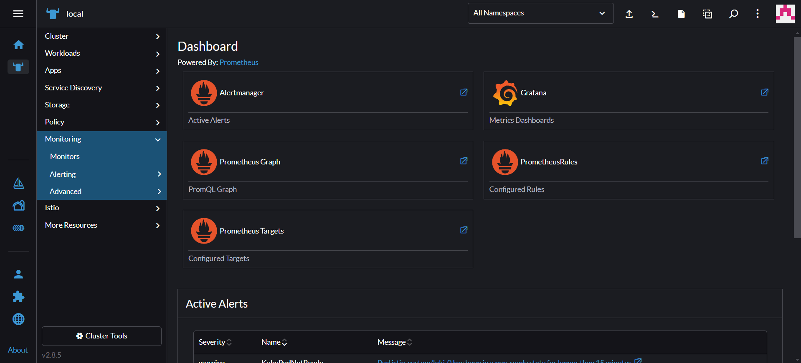

# Prometheus and Grafana
Add prometheus rules and grafana dashboards.

## Prerequisites
Make sure you have followed the tutorial on `docs/other-configurations/rancher/README.md` before proceding. 

## Instalation

1. Enter rancher with username and password. 

2. Click on the name of your cluster.

3. Click on Cluster Tools.

4. Click Install Monitoring and follow the steps to install.

5. After it finishes installing, you can access both prometheus and grafana in the Monitoring area.
 